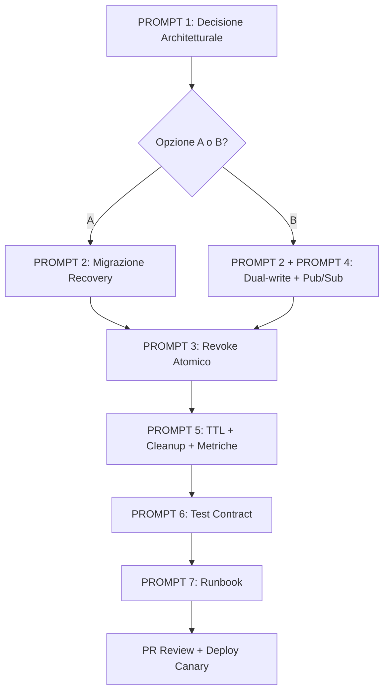

# Scheda FIX-101: Risoluzione Definitiva Problemi Token Registry

**Priorità:** CRITICA  
**Stato:** DA APPROVARE  
**Bloccante per:** Qualsiasi deploy multi-istanza / produzione con Redis

---

## Contesto

L'analisi di `server/tokenRegistry.js` ha rivelato **due store non sincronizzati** (Redis + Map in-memory) con:
- Nessuna migrazione dati al failover/rilink Redis
- Revoca token non propagata a entrambi gli store
- Error swallowing in `revokeSession`
- Assenza totale di Pub/Sub per invalidazione cross-instance
- TTL hardcoded, cleanup solo on-read

---

## Prompt di Fix — Da Eseguire in Ordine Sequenziale

---

### PROMPT 1: Definire Strategia di Storage (Single Source of Truth)

> **Obiettivo:** Eliminare l'ambiguità "due store, uno attivo alla volta".
>
> **Decisione richiesta:** Scegliere **UNA** delle due architetture:
>
> **OPZIONE A — Solo Redis con Resilienza (RACCOMANDATA)**
> - Rimuovere `socketTokenRegistry` (Map in-memory)
> - Implementare retry con backoff esponenziale su operazioni Redis
> - Coda locale in-memory **solo per write durante outage** (max N record, TTL breve) + flush atomico al recovery
> - Circuit breaker: dopo X failure consecutivi → rifiuta nuove sessioni (fail-fast) invece di servire dati stantii
>
> **OPZIONE B — Dual-Write Sincrono + Reconciliazione + Pub/Sub**
> - Scrivere **sempre** su entrambi gli store
> - Background job di reconciliazione (ogni 30s) che allinea Redis ↔ Map
> - Pub/Sub channel `token:invalidate` per propagare revoche cross-instance
> - Versioning/timestamp sui record per conflict resolution (last-write-wins con clock sincronizzato)
>
> **Output atteso:** Documento `ARCHITECTURE_DECISION.md` con scelta motivata, diagramma flusso dati, failure modes.

---

### PROMPT 2: Implementare Migrazione Dati al Recovery Redis (se Opzione A con coda / Opzione B)

> **Obiettivo:** Zero perdita token validi durante transizioni Redis down/up.
>
> **Requisiti:**
> - Listener `pubClient.on('ready', ...)` che trigga migrazione/flush
> - Listener `pubClient.on('end' | 'error', ...)` che attiva modalità degraded
> - Metrica `token_registry_migration_total{status="success|failure"}` + latency histogram
> - Log strutturato: `token.registry.migration.started/completed/failed` con `count`, `durationMs`
> - Idempotenza: record con stesso `jti` non duplicati (upsert con `SET NX` + confronto `expiresAtMs`)
> - Timeout migrazione: max 5s, poi alert + fallback manuale

---

### PROMPT 3: Refactor `revokeSession` — Propagazione Garantita + Observability

> **Obiettivo:** Revoca atomica, visibile ovunque, tracciabile.
>
> **Modifiche richieste:**
> - **Scrittura doppia esplicita** (o publish su channel Pub/Sub se Opzione B) — mai "solo store attivo"
> - **Transazione/Atomico:** `WATCH jti` → `MULTI` → set `revoked=true` → `EXEC` (Redis) + update Map — rollback se fallisce uno dei due
> - **Eliminare error swallowing:** Distinguere:
>   - `JWT_INVALID` / `JWT_EXPIRED` → 400, log `warn`
>   - `REDIS_UNAVAILABLE` → 503, log `error`, metric `revoke.failed.redis_down`
>   - `TOKEN_NOT_FOUND` → 404, log `info`
>   - `CONCURRENT_MODIFICATION` (WATCH failed) → retry max 3x con backoff
> - **Return value arricchito:** `{ revoked: boolean, source: 'redis'|'memory'|'both', jti, timestamp }`
> - **Audit log:** `token.revoked` con `jti`, `sid`, `ip`, `userAgent`, `reason` (manual|timeout|security|admin)

---

### PROMPT 4: Implementare Pub/Sub Invalidazione Cross-Instance

> **Obiettivo:** Se istanza A revoca token, istanza B lo sa entro <100ms.
>
> **Specifica:**
> - Channel: `anima:token:invalidate`
> - Payload: `{ jti, revokedAt: ISO8601, sourceInstanceId, reason }`
> - **Publisher:** `revokeSession` → `pubClient.publish(channel, JSON.stringify(payload))` (fire-and-forget, non bloccante)
> - **Subscriber:** `subClient.subscribe(channel)` all'avvio → handler che:
>   - Invalida cache locale (`socketTokenRegistry.delete(jti)`)
>   - Chiude socket attivo se `activeSocketId` match (emit `auth-revoked` + `disconnect`)
>   - Log `token.invalidate.received` con `jti`, `latencyMs`
> - **Deduplicazione:** `subClient` ignora messaggi con `sourceInstanceId === myInstanceId`
> - **Resilienza:** Se `subClient` disconnesso → al `ready` fare `SCAN token:*` + confronto `revoked` flag (reconciliazione full)

---

### PROMPT 5: TTL Configurabile + Cleanup Periodico + Metriche

> **Obiettivo:** Nessun hardcoding, nessuna leak memoria, visibilità completa.
>
> **Interventi:**
> - `TOKEN_TTL_SECONDS` da env (default 3600) — usato in `setTokenRecord` (EX Redis) e `expiresAtMs` Map
> - **Cleanup job:** `setInterval(cleanupSocketTokenRegistry, CLEANUP_INTERVAL_MS)` (default 60s, configurable)
> - **Metriche Prometheus:**
>   - `token_registry_size{store="redis|memory"}`
>   - `token_registry_cleanup_total{removed_count}`
>   - `token_registry_operations_total{op="set|get|revoke", store="redis|memory", status="ok|error"}`
>   - `token_registry_ttl_seconds` (gauge)
> - **Health check endpoint:** `/health/token-registry` → `{ redis: bool, memorySize: number, oldestTokenAgeMs: number }`

---

### PROMPT 6: Test di Regressione Obbligatori (Contract Tests)

> **Obiettivo:** Garantire che i fix non regrediscano.
>
> **Scenari da automatizzare (Jest + Testcontainers Redis):**
>
> | Test Case | Descrizione | Assert |
> |-----------|-------------|--------|
> | `revoke_propagates_to_both_stores` | Revoca con Redis up → token revocato su Redis E Map | `getTokenRecord` da entrambi ritorna `revoked=true` |
> | `revoke_during_redis_outage` | Redis down → revoca → Redis up → token revocato su Redis | Dopo recovery, `getTokenRecord(jti).revoked === true` |
> | `redis_recovery_migrates_memory_tokens` | Token creati in Map durante outage → Redis up → token visibili su Redis | `SCAN token:*` count = Map size pre-recovery |
> | `pubsub_invalidate_cross_instance` | Due processi Node + Redis condiviso → revoca su P1 → P2 invalida cache locale | P2 `socketTokenRegistry.has(jti) === false` entro 200ms |
> | `concurrent_revoke_same_token` | Due richieste revoca simultanee stesso JTI | Una sola riesce, l'altra ritorna `revoked: true` (idempotente) |
> | `cleanup_removes_expired_only` | Token scaduti + validi in Map → cleanup → solo scaduti rimossi | `Map.size` diminuito di `expiredCount`, validi intatti |
> | `ttl_configurable_via_env` | `TOKEN_TTL_SECONDS=7200` → nuovo token → TTL Redis = 7200 | `TTL token:*` ≈ 7200s |
>
> **Coverage minima:** 90% su `tokenRegistry.js`, `sessionService.js` (revoke), `redis.js` (listener).

---

### PROMPT 7: Documentazione Operativa (Runbook)

> **Obiettivo:** On-call può diagnosticare/risolvere senza codice.
>
> **Contenuto `RUNBOOK_TOKEN_REGISTRY.md`:**
> - Architettura scelta (Opzione A/B) + diagramma
> - Come verificare sync status: `redis-cli SCAN token:*` vs `node -e "require('./tokenRegistry').socketTokenRegistry.size"`
> - Comandi manuali: `FLUSH token registry`, `FORCE MIGRATION`, `MANUAL REVOKE <jti>`
> - Alerting rules: `token_registry_migration_failed > 0`, `revoke_failed_total > 5/5m`, `redis_down > 1m`
> - Rollback procedure: come disabilitare dual-write / Pub/Sub se causa instabilità

---

## Sequenza di Esecuzione Obbligatoria

---

## Definition of Done (Per Considerare la Scheda CHIUSA)

- [ ] `ARCHITECTURE_DECISION.md` approvato da Tech Lead + Security
- [ ] Zero `socketTokenRegistry` usage se Opzione A, oppure dual-write verificato nei test se Opzione B
- [ ] `revokeSession` non ha `catch` generico che ritorna `false` senza log
- [ ] Pub/Sub invalidazione funzionale cross-instance (test automatizzato passa)
- [ ] Metriche Prometheus esposte e dashboard Grafana creato
- [ ] Tutti i test contract in `PROMPT 6` passano in CI (GitHub Actions / GitLab CI)
- [ ] Runbook pubblicato su wiki/internal docs
- [ ] Canary deploy 10% traffico → 0 errori `token.registry` per 24h → rollout 100%

---

## Note per l'Agente Esecutore

> **NON** implementare codice in questa scheda.  
> Questa scheda contiene **solo i prompt** da passare all'agente di coding (o da eseguire manualmente).  
> Ogni PROMPT = un task atomico, testabile, committabile separatamente.  
> Ordine vincolante: 1 → 2/4 → 3 → 5 → 6 → 7.